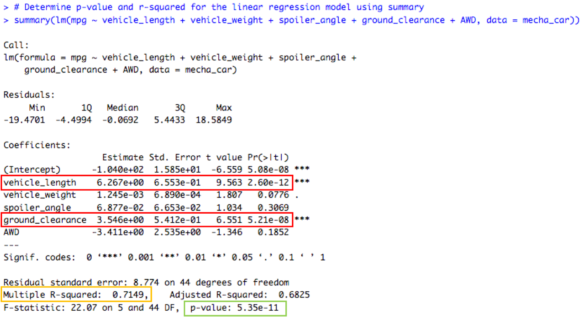
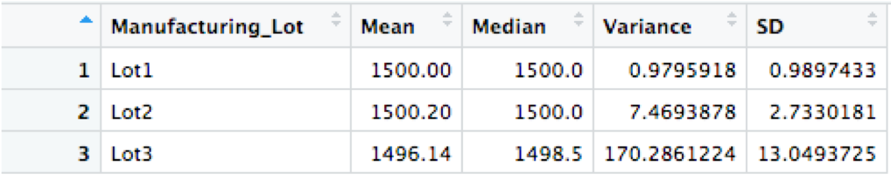
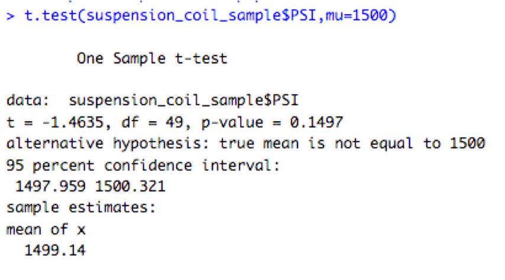
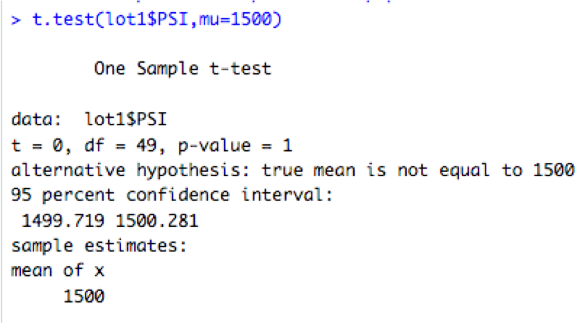
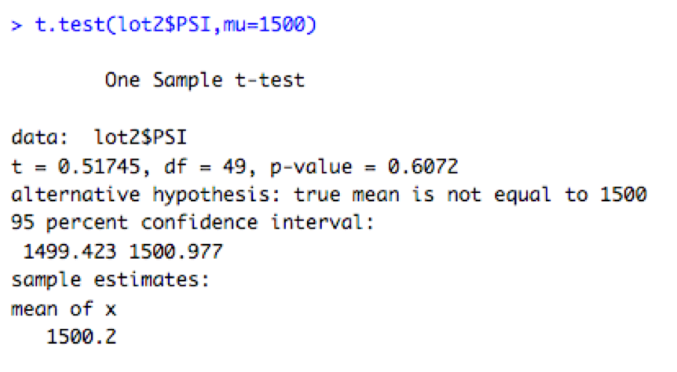
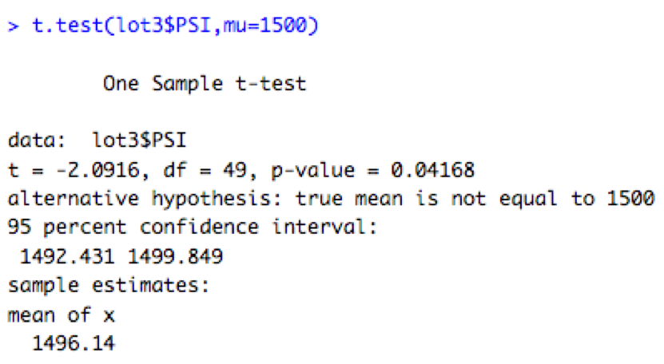

# MechaCar_Statistical_Analysis

## Overview 

The AutosRUs’ newest prototype, the MechaCar, is suffering from production troubles that are blocking the manufacturing team’s progress. Management has requested to review the production data for insights to help the manufacturing team.

The analysis study includes the following: 

* Perform multiple linear regression analysis to identify which variables in the dataset predict the mpg of MechaCar prototypes.

* Collect summary statistics on the pounds per square inch (PSI) of the suspension coils from the manufacturing lots.

* Run t-tests to determine if the manufacturing lots are statistically different from the mean population.

* Design a statistical study to compare vehicle performance of the MechaCar vehicles against vehicles from other manufacturers. For each statistical analysis, write a summary interpretation of the findings.

## Results

### Multiple Linear Regression Analysis

* Results of the multiple linear regression analysis, show that 2 variables, vehicle_length and ground_clearence, are unlikely to provide random amounts of variance to the linear model, based on the p-value resulting < 0.05% (assumed significant level). This means that these 2 variables have a significant impact on the linear model therefore on the prediction of the mpg for the MechaCar prototypes.

* The p-value of the multiple linear regression analysis is 5.35 x 10-11, which is much smaller than the assumed significance level of 0.05%. Therefore, we can state that there is sufficient evidence to reject our null hypothesis, which means that the slope of our model is not zero.

* The R-squared of the model is 0.7149, which means that about 71% of the mpg (dependent variable) can be predicted by this linear model. Therefore, we can say that this model effectively predict the mpg of MechaCar prototypes
 
### Summary Statistics on Suspension Coils

The total summary statistics of the suspension coil’s psi shows that for all manufacturing lots in total the design specification is met since the variance of the total data is 62.3 psi. See table below

The summary statistics by manufacturing lots shows that Lot1 and Lot2 meet the design specification (variance < 100 psi) while Lot3 does not meet design specification, variance is 170.3 psi. 

### T-Tests on Suspension Coils

The T-test across all manufacturing lots shows that there is no statistical difference with respect to the population mean, the p-value is greater than assumed significance level (0.05), therefore doesn't support to reject the null hypothesis. See results below

The T-tests run for each Lot shows that for Lot1 and Lot2, there is no statistical difference with respect to the population mean, p-values are greater than assumed significance level (0.05), therefore doesn't support to reject the null hypothesis. See results below

On the other hand, for Lot3 the p-value (0.04168) is less than assumed significance level, which means there is statistical difference therefore supporting to reject the null hypothesis. See below

## Study Design: MechaCar vs Competition

There are many things that can be compare when purchasing a car, one of those that buyers should consider when comparing cars would be safety systems. In order to study MechaCars vs competitors, one safety system could be air bags activation in collision. 

Null Hypothesis: MechaCars average air bag activation is similar to competitor vehicles 
Alternative Hypothesis: MechaCars average air bag activation is significantly different than competitor vehicles.

