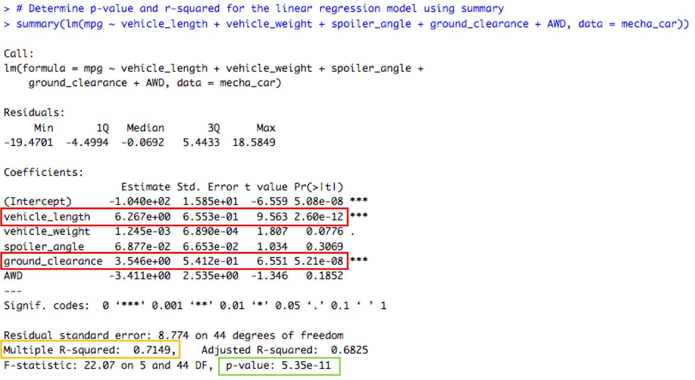

# MechaCar_Statistical_Analysis

## Overview 

The AutosRUs’ newest prototype, the MechaCar, is suffering from production troubles that are blocking the manufacturing team’s progress. Management has requested to review the production data for insights to help the manufacturing team.

The analysis study includes the following: 

* Perform multiple linear regression analysis to identify which variables in the dataset predict the mpg of MechaCar prototypes.

* Collect summary statistics on the pounds per square inch (PSI) of the suspension coils from the manufacturing lots.

* Run t-tests to determine if the manufacturing lots are statistically different from the mean population.

* Design a statistical study to compare vehicle performance of the MechaCar vehicles against vehicles from other manufacturers. For each statistical analysis, write a summary interpretation of the findings.

## Results

Multiple Linear Regression Analysis

* Results of the multiple linear regression analysis, show that 2 variables, vehicle_length and ground_clearence, are unlikely to provide random amounts of variance to the linear model, based on the p-value resulting < 0.05. This means that these 2 variables have a significant impact on the linear model therefore on the prediction of the mpg for the MechaCar prototypes.

* 
